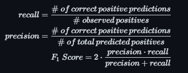

# Analyzing US Election Polling Data
## Description
#### Background 
[FiveThirtyEight (538)](https://fivethirtyeight.com/about-us/) is a website that has historically investigated and reported on polls, economics, and sports through a statistical and data analytical lense. Their [election forecast](https://projects.fivethirtyeight.com/2022-election-forecast/) uses aggregates of polls and ratings about individual polling organizations (pollsters) to predict who will win elections and analyze trends on a national level. They provide [pollster ratings](https://projects.fivethirtyeight.com/pollster-ratings/) based on a pollster's historic performance along with their polling methodology. Their [data](https://github.com/fivethirtyeight/data/tree/master/pollster-ratings) is publicly available on GitHub. As of October 13th, 2023, 538's website has been archived and their articles have been moved to the [538 section of ABC's website](https://abcnews.go.com/538).

#### Goals & Process
We took the [raw historical polling data](/data/raw-polls.csv) along with 538's updated [pollster rankings](/data/pollster-ratings.csv) and analyzed trends across pollsters, time, race type, and other aggregate measures. We then attempted to model whether a poll was correct or not based on measures of the poll and historical trends for the pollster administering it. Additionally, we applied clustering algorithms to find trends and similar clumps of polls with the goal of clustering the inaccurate polls. 

#### Data Dictionaries
The data dictionary for the raw-polls.csv can be found on [538's GitHub](https://github.com/fivethirtyeight/data/tree/master/pollster-ratings) while the data dictionary for pollster-ratings.csv can be found [here](/data/pollster-ratings-dict.csv). The pollster ratings data dictionary was extracted from an excel file hosted in the repo that our data came from. All features extracted are explained in the [relevant notebook](/code/01-Cleaning_and_Feature_Extraction.ipynb).

## Project Outline
1. [Cleaning and Feature Extraction](/code/01-Cleaning_and_Feature_Extraction.ipynb)
2. [Exploratory Data Analysis](/code/02-EDA.ipynb)
3. [Predictive Modeling](/code/03-Predictive_Modeling.ipynb)
4. [Clustering](/code/04-Clustering.ipynb)

## Software Requirements
All analysis was done using Python 3.11 with up to date libraries as of 10/06/2023. The following packages were used:
- Pandas
- Numpy
- Scikit-learn
- Matplotlib
- Seaborn
- SpaCy
## Data Processing
538's data is well-maintained and had few errors or oversights. There were some missing values that needed to be addressed, in particular the bias was not calculated for a number of polls, despite their being an error calculated for each poll. We calculated bias manually and used that value for our analysis. A number of polls had comments listed which added context to the poll such as whether it was of registered voters only or if an organization had sponsored them. We used the [spaCy](https://spacy.io/) library which provides pre-trained language processing models to extract relevant features from the comments. For a full look at our cleaning and feature extraction, see [Cleaning and Feature Extraction Notebook](/code/01-Cleaning_and_Feature_Extraction.ipynb).

## Modeling

### Classification

#### Models
We attempted to predict whether a poll was correct or not using the following models:
- [Logistic Regression](https://en.wikipedia.org/wiki/Logistic_regression): A linear model using the logit link that predicts the log-odds of an event which can then be used to calculate the probability of that event. This model struggles with detecting non-linear relationships within our data and are not robust to outliers.
- [Decision Tree](https://en.wikipedia.org/wiki/Decision_tree): A hierarchical tree-based model that splits data repeatedly on conditions in an attempt to create subsets of our data that are entirely or mostly the same class. Decision Tree's are capable of detecting non-linear relationships but are not robust to outliers. 
- [Random Forest](https://en.wikipedia.org/wiki/Random_forest): An ensemble model that creates a number of low-complexity decision trees on [bootstrapped](https://en.wikipedia.org/wiki/Bootstrapping_(statistics)) samples of our data. The final prediction is then the average of all the predictions from the individual decision trees.

Our initial hope was that Logistic Regression would perform well enough to allow us to gain insight into how our features were relevant to predicting whether a poll was correct or not. We found that the Logistic Regression did not perform better than the baseline of 78% accuracy but that both tree-based attempts did. We found 82% accuracy with our single decision tree and 83% with our Random Forest model. We also found that our model was more accurate with polls that were not party affiliated (84% accuracy) than it was with party-affiliate polls (78% accuracy). We believe this result is mainly due to the vast majority of our polls being unaffiliated with any party but it is still an interesting result that may be worth further investigation.
#### Metrics
Model performance was primarily measured by accuracy, but recall, precision and F1 Score were also used for a more wholistic picture of in what ways our model was misclassifying our outcome. The formulas for these metrics are as follows:

    

    

- Accuracy: The overall rate at which our model predicts correctly
- Recall (Sensitivity): The rate at which our model correctly classifies correct polls as correct
- Precision (Positive Predictive Value): The rate at which our model's predicted correct polls are correct in reality
- F1 Score: The [harmonic mean](https://en.wikipedia.org/wiki/Harmonic_mean) of precision and recall. This helps us understand how balanced our predictions are across correct and incorrect called races.

### Clustering

#### Algorithms
We employed the following clustering algorithms:
- [K-Means](https://en.wikipedia.org/wiki/K-means_clustering): A method of clustering that creates k clusters with minimal within-cluster variation.
- [Density-Based Spatial Clustering of Applications with Noise (DBSCAN)](https://en.wikipedia.org/wiki/DBSCAN): A clustering algorithm that isolates clusters of similar densities and is capable of identifying points that do not fit into any clusters.
- [Hierarchical DBSCAN (HDBSCAN)](https://hdbscan.readthedocs.io/en/latest/how_hdbscan_works.html): An extension of the DBSCAN algorithm that is capable of detecting clusters of different densities.

Additionally, we employed [Principle Component Analysis (PCA)](https://www.sartorius.com/en/knowledge/science-snippets/what-is-principal-component-analysis-pca-and-how-it-is-used-507186) which is a method of dimensionality reduction that creates a representation of our original data with linearly uncorrelated features that maximize the variance in our data. When used in conjunction with our clustering algorithms, PCA allows us to create more separate clusters. 
#### Metric
We assessed clustering performance using [Silhouette score](https://en.wikipedia.org/wiki/Silhouette_(clustering)). An individual silhouette measures how similar a data point is to its cluster against how different it is from other clusters. When aggregated this gives a measure of how well-separated our clusters are. As noted at the end of [the Clustering Notebook](/code/04-Clustering.ipynb), we later learned that Silhouette Score is not a suitable metric for measuring the performance density-based clustering algorithms so the scores reported for DBSCAN and HDBSCAN models are not necessarily accurate to how effectively those models are clustering our data.
## Conclusion & Future Work
We were able to somewhat accurately predict whether a poll would be correct or not based on our measures of the poll and 538's rating for that pollster. While we were only able to reach an accuracy of 83% with our highest performing model, we believe that this approach has merit and could be worth further study. In particular, it would be prudent to explore only polls where the race is competitive as many House races in particular are won by the incumbent with little to no resistance from any challengers. Additionally, training a model using 538's Pollster-level measures of Bias and historical accuracy could have merit if used to predict whether future polls are correct or not. These measures were excluded for our purposes because historical accuracy takes into account the polls in our data but if we were to gather polls in a future election cycle, we would have a self-contained test set to compare our predictions against. For our clustering approach, we saw some very promising results with density-based approaches. In particular, HDBSCAN was able to create clusters of near-completely inaccurate polls. An extension of our work could use those clusters as a response variable and train a model to classify polls into those clusters while omitting variables such as bias, error, and rightcall which can only be measure after an election has occurred. The cluster assigned could then be used as a proxy for whether a poll was correct for a different approach to prediction.

Our largest takeaway is how difficult it was to improve our baseline accuracy. Generally, polls are accurate and trying to separate the accurate and the inaccurate polls proved to be quite difficult. While our best model performed admirably, a more complex model or a more sophisticated approach to modeling, such as those described above, would likely be needed to improve much past our best-results.